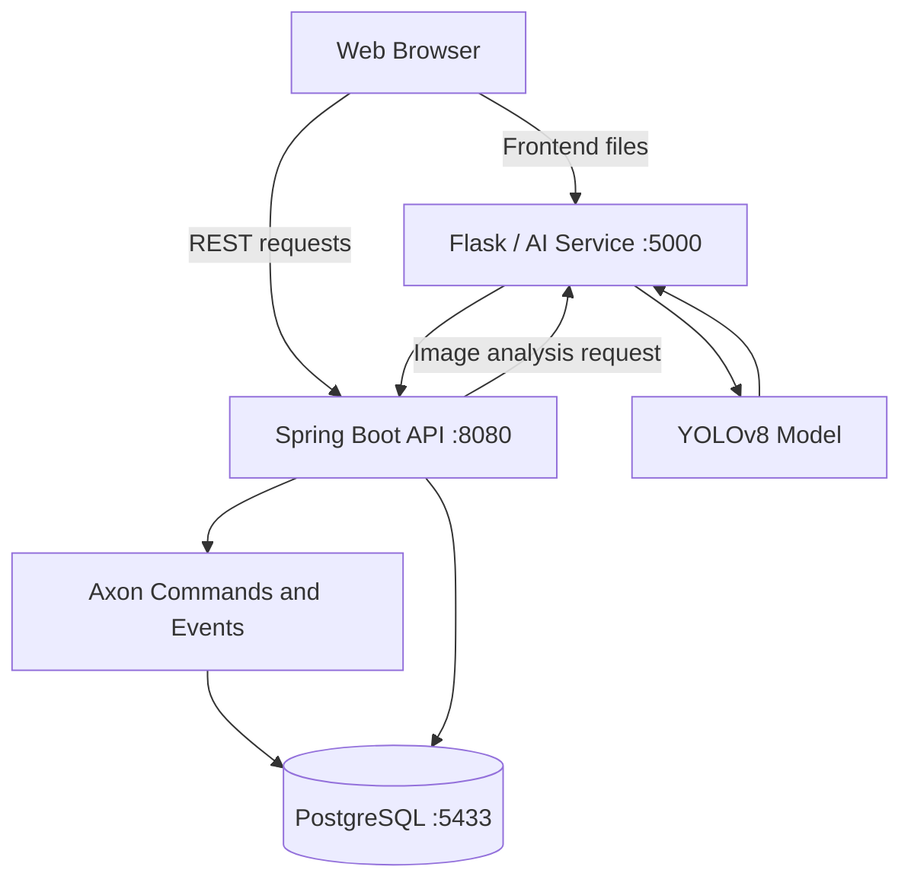

# RoadWatch — Accident Scene Management System

RoadWatch is a web application for creating, analyzing, editing, and storing digital accident-scene reconstructions.

The system combines:

- A browser-based accident-scene editor
- AI vehicle detection using YOLO
- A Kotlin and Spring Boot backend
- PostgreSQL persistence
- Axon-based commands, events, and aggregate state
- Reusable location templates
- Docker Compose for running the complete system

Users can manually construct an accident scene or upload an image for AI analysis. Scenes, vehicles, measurements, reusable locations, uploaded location pictures, and AI results can then be stored and reopened.

## Main features

### Accident-scene editor

The editor allows users to:

- Select a predefined road layout
- Select a previously saved location
- Enter location information manually
- Add, move, rotate, resize, and remove vehicles
- Edit vehicle details such as:
  - Name
  - Type
  - Model
  - Color
  - Registration plate
  - Comment
  - Responsibility status
- Add and remove measurements
- Save the scene to PostgreSQL
- Save the scene as a new accident
- Export the scene as JSON
- Export the canvas as an image
- Import previously exported JSON files
- Finalize or archive completed accident scenes

Each accident has its own file name. The accident file name is separate from the selected location and is used as the scene title in the Saved Accident Scenes tab.

### AI analysis

The user can upload an accident-scene image and run AI analysis.

The AI service uses YOLOv8 to detect:

- Cars
- Motorcycles
- Buses
- Trucks

For each detected vehicle, the service returns:

- Position
- Bounding-box width and height
- Estimated rotation
- Vehicle type
- Detection confidence

The Spring Boot service converts the AI response into domain objects and stores the result in the accident-scene aggregate.

Vehicle-to-vehicle measurements are calculated by the Spring Boot service using the detected vehicle center points:

```text
distance in metres = pixel distance / pixels-per-metre
```

The default scale is:

```properties
roadwatch.measurements.pixels-per-meter=10.0
```

This value can be changed in `src/main/resources/application.properties`.

After successful analysis, the editor enters AI mode. Manual editing can then be enabled with the **Switch to Edit Mode** button.

### Reusable locations

A location is stored independently and can be shared by multiple accident scenes.

A location contains:

- Location name
- Description
- Road-layout type
- Background layout
- Road widths
- Lane counts
- Roundabout diameter
- T-junction flag
- Optional PNG or JPEG picture

An accident scene has a many-to-one relationship with a location:

```text
Many Accident Scenes → One Location
```

Selecting a location automatically fills the corresponding editor fields without changing the current vehicles, measurements, or accident file name.

Locations behave as reusable templates. Editing a selected location’s values for a particular accident creates or reuses a matching location rather than modifying the original location used by other accidents.

### Location templates

The Add Location screen supports these starting templates:

- Four-way Intersection
- Roundabout — 3 Exits, 1 Lane
- Roundabout — 3 Exits, 2 Lanes
- Roundabout — 4 Exits, 1 Lane
- Roundabout — 4 Exits, 2 Lanes
- T-Junction
- Boulevard — Solid Median
- Boulevard — Tree-Lined Median

Preset dimensions are example values and should be replaced with measurements for the real location.

### Location pictures

PNG and JPEG images can be uploaded for locations.

The current limits are:

- Maximum file size: 10 MB
- Maximum image size: 25 megapixels
- Accepted formats: PNG and JPEG

Image data is stored in PostgreSQL in the `location_photo` table. Photos are identified by a content hash so identical photos can be reused.

### Location deletion

Locations can be deleted from the Saved Locations tab.

Deletion is prevented when a location is referenced by any saved accident, including:

- Draft scenes
- AI-analyzed scenes
- Finalized scenes
- Archived scenes

This prevents broken accident-to-location references.

### Searching saved accidents

Saved Accident Scenes supports combined filtering by:

- Accident file name or scene ID
- Vehicle registration plate
- Location
- Scene status

Plate matching:

- Is case-insensitive
- Supports partial values
- Ignores spaces
- Ignores hyphens

For example, these values can match the same plate:

```text
SK-1234 AB
sk1234ab
1234
```

### Accident lifecycle

An accident scene can have one of four statuses:

```text
DRAFT
  ↓
AI_ANALYZED
  ↓
FINALIZED
  ↓
ARCHIVED
```

`DRAFT` and `AI_ANALYZED` scenes can be edited.

A scene can only be finalized when it has:

- A selected or saved location
- At least one vehicle

Only a finalized scene can be archived.

## Architecture



The complete request flow for AI analysis is:

```text
Browser
  → Spring Boot API
  → Flask AI service
  → YOLO model
  → Flask AI response
  → Spring domain mapping
  → Axon command and event
  → PostgreSQL
  → Browser response
```

## Technology stack

### Frontend

- HTML5
- CSS
- JavaScript ES modules
- Canvas API

### Backend

- Kotlin 2.0
- Java 21
- Spring Boot 3.3
- Spring Web
- Spring Data JPA
- Spring Validation
- Spring Cloud OpenFeign
- Resilience4j
- Axon Framework
- PostgreSQL
- H2 for automated tests

### AI service

- Python 3.12
- Flask
- Ultralytics YOLOv8
- OpenCV
- NumPy
- Pydantic
- CPU-only PyTorch Docker installation

### Infrastructure

- Docker
- Docker Compose
- Maven
- PostgreSQL 16

## Project structure

```text
Seminarska_Veb_Programiranje/
├── AccidentProject/
│   └── AccidentProject/
│       ├── accident-ai/
│       │   ├── Dockerfile
│       │   ├── server.py
│       │   ├── extract_scene.py
│       │   ├── requirements.txt
│       │   └── yolov8n.pt
│       └── RoadWatch/
│           ├── index.html
│           ├── style.css
│           ├── app.js
│           ├── backend-api.js
│           ├── ai.js
│           ├── canvas.js
│           ├── locations.js
│           ├── location-presets.js
│           ├── measurements.js
│           ├── saved-scenes.js
│           ├── storage.js
│           ├── ui.js
│           └── assets/
├── src/
│   ├── main/
│   │   ├── kotlin/com/example/accidentscatchmanagement/
│   │   │   ├── client/
│   │   │   ├── config/
│   │   │   ├── domain/
│   │   │   ├── handlers/
│   │   │   ├── repository/
│   │   │   ├── service/
│   │   │   └── web/
│   │   └── resources/
│   └── test/
├── tests/
│   └── location-ui.cjs
├── docs/
│   └── LOCATION_FEATURES.md
├── docker-compose.yml
├── Dockerfile
├── pom.xml
├── mvnw
└── mvnw.cmd
```

## Domain model

### AccidentScene

The accident-scene aggregate contains:

- Accident-scene ID
- Accident file name
- Road-layout type
- Location ID
- Scene status
- Vehicles
- Measurements
- AI confidence
- AI summary
- Creation time
- Last-update time

### Location

A location contains reusable information about a physical road location.

The accident file name does not belong to the location. This allows several accidents at the same location to have different names.

### VehiclePlacement

A vehicle placement contains:

- Vehicle ID
- Name
- Type
- Model
- Color
- Plate
- Guilty flag
- Comment
- Canvas position
- Width and height
- Rotation
- Scale
- Flipped state
- Note
- AI confidence

### MeasurementLine

A measurement may be one of:

```text
POINT_TO_POINT
VEHICLE_TO_POINT
VEHICLE_TO_VEHICLE
```

It stores:

- Measurement ID
- Source vehicle ID
- Target vehicle ID
- Start and end coordinates
- Length in metres
- Label

## Commands and events

The backend uses Axon Framework to process changes through commands and events.

Examples of commands include:

- Create accident scene
- Change road layout
- Update location
- Add, update, or remove vehicle
- Add or remove measurement
- Store full scene
- Store AI analysis
- Finalize scene
- Archive scene

Examples of events include:

- `AccidentSceneCreatedEvent`
- `RoadLayoutChangedEvent`
- `SceneLocationUpdatedEvent`
- `VehicleAddedEvent`
- `VehicleUpdatedEvent`
- `VehicleRemovedEvent`
- `MeasurementAddedEvent`
- `MeasurementRemovedEvent`
- `AIAnalysisStoredEvent`
- `FullSceneStoredEvent`
- `AccidentSceneFinalizedEvent`
- `AccidentSceneArchivedEvent`

Axon event records are stored in PostgreSQL alongside the current JPA state.

## Running the application with Docker

### Requirements

Install:

- Docker Desktop
- Docker Compose
- Git

Make sure Docker Desktop is running before executing Docker commands.

### Start the application

Open a terminal in the repository root:

```powershell
cd C:\Users\YOUR_USERNAME\IdeaProjects\Seminarska_Veb_Programiranje
```

Build and start all services:

```powershell
docker compose up -d --build
```

The first AI-service build can take longer because it downloads Python, PyTorch, OpenCV, and Ultralytics dependencies.

### Application URLs

| Component | URL |
|---|---|
| Web application | `http://localhost:5000` |
| Spring Boot API | `http://localhost:8080` |
| PostgreSQL host port | `localhost:5433` |

After rebuilding, use `Ctrl+F5` in the browser to reload the JavaScript files without using the browser cache.

### Check running containers

```powershell
docker compose ps
```

or:

```powershell
docker ps
```

Expected containers:

```text
accident_ai_service
accident_scene_service
accident_scene_db
```

### View service logs

All services:

```powershell
docker compose logs -f
```

Spring Boot:

```powershell
docker compose logs -f accident_scene_service
```

AI service:

```powershell
docker compose logs -f accident_ai_service
```

PostgreSQL:

```powershell
docker compose logs -f accident_scene_db
```

### Stop the application

```powershell
docker compose down
```

This stops the containers but preserves PostgreSQL data in the `accident_scene_data` Docker volume.

Do not add `-v` unless you intentionally want to delete the stored database volume.

## Running services locally

### Spring Boot backend

Requirements:

- JDK 21
- PostgreSQL running on port 5433
- AI service running on port 5000

Windows:

```powershell
$env:JAVA_HOME = "C:\path\to\jdk-21"
.\mvnw.cmd spring-boot:run
```

Linux or macOS:

```bash
./mvnw spring-boot:run
```

The default backend configuration expects:

```properties
spring.datasource.url=jdbc:postgresql://localhost:5433/accident_scene_db
spring.datasource.username=postgres
spring.datasource.password=postgres
roadwatch.ai-service.url=http://localhost:5000
```

### AI service and frontend

From the AI directory:

```powershell
cd AccidentProject\AccidentProject\accident-ai
python -m venv .venv
.\.venv\Scripts\Activate.ps1
pip install -r requirements.txt
python server.py
```

The Flask server listens on all local interfaces:

```text
http://127.0.0.1:5000
http://<computer-local-IP>:5000
```

The second address allows access from another device on the same network when Windows Firewall permits it.

## REST API overview

### Accident scenes

| Method | Endpoint | Purpose |
|---|---|---|
| `POST` | `/api/accident-scenes` | Create a scene |
| `GET` | `/api/accident-scenes` | Search and paginate scenes |
| `GET` | `/api/accident-scenes/{id}` | Get a complete scene |
| `DELETE` | `/api/accident-scenes/{id}` | Delete a scene |
| `PUT` | `/api/accident-scenes/{id}/full-scene` | Save the full scene |
| `PATCH` | `/api/accident-scenes/{id}/road-layout` | Change the road layout |
| `PATCH` | `/api/accident-scenes/{id}/location` | Change the location |
| `POST` | `/api/accident-scenes/{id}/vehicles` | Add a vehicle |
| `PUT` | `/api/accident-scenes/{id}/vehicles/{vehicleId}` | Update a vehicle |
| `DELETE` | `/api/accident-scenes/{id}/vehicles/{vehicleId}` | Remove a vehicle |
| `POST` | `/api/accident-scenes/{id}/measurements` | Add a measurement |
| `DELETE` | `/api/accident-scenes/{id}/measurements/{measurementId}` | Remove a measurement |
| `POST` | `/api/accident-scenes/{id}/analyze` | Analyze an uploaded image |
| `POST` | `/api/accident-scenes/{id}/finalize` | Finalize a scene |
| `POST` | `/api/accident-scenes/{id}/archive` | Archive a finalized scene |

Example combined search:

```text
GET /api/accident-scenes?query=report&plate=SK1234AB&locationId=Location:123&status=DRAFT&page=0&size=12
```

### Locations

| Method | Endpoint | Purpose |
|---|---|---|
| `GET` | `/api/locations` | Search and paginate locations |
| `POST` | `/api/locations` | Create or reuse a location |
| `GET` | `/api/locations/{id}` | Get a location |
| `DELETE` | `/api/locations/{id}` | Delete an unused location |
| `GET` | `/api/locations/{id}/photo` | Get the location picture |

`POST /api/locations` accepts either:

- A JSON `LocationInput`
- Multipart form data with:
  - `location`: JSON location data
  - `photo`: optional PNG or JPEG file

Location deletion returns:

- `204 No Content` when deletion succeeds
- `404 Not Found` when the location does not exist
- `409 Conflict` when an accident references the location

### Direct AI endpoint

```text
POST http://localhost:5000/analyze
```

The request must contain multipart form data with an `image` field.

Example using PowerShell:

```powershell
curl.exe -X POST `
  -F "image=@C:\path\to\accident-image.png" `
  http://localhost:5000/analyze
```

## Database

Docker exposes PostgreSQL on host port `5433`.

Connection values:

```text
Database: accident_scene_db
Username: postgres
Password: postgres
Host: localhost
Port: 5433
```

These credentials are intended for local development.

### Open PostgreSQL inside Docker

```powershell
docker exec -it accident_scene_db psql -U postgres -d accident_scene_db
```

List tables:

```sql
\dt
```

Describe a table:

```sql
\d accident_scene
```

View accident scenes:

```sql
SELECT * FROM accident_scene;
```

View reusable locations:

```sql
SELECT * FROM location;
```

View vehicles:

```sql
SELECT * FROM accident_scene_vehicles;
```

View measurements:

```sql
SELECT * FROM accident_scene_measurements;
```

View Axon events:

```sql
SELECT
    global_index,
    aggregate_identifier,
    sequence_number,
    type,
    time_stamp
FROM domain_event_entry
ORDER BY global_index DESC;
```

Exit PostgreSQL:

```sql
\q
```

## Persistence and migration

The application uses:

```properties
spring.jpa.hibernate.ddl-auto=update
```

Hibernate adds missing tables and columns without requiring the existing PostgreSQL volume to be deleted.

The application also includes migrations for older data:

- `LegacyLocationMigration` converts formerly embedded scene-location values into reusable locations.
- `SceneFileNameMigration` moves old location file names into the corresponding accident scenes.

Migration markers are stored in:

```text
roadwatch_schema_migration
```

The old columns are retained for compatibility with historical data and event payloads.

## Testing

### Backend tests

Backend tests use an isolated in-memory H2 database and do not modify the Docker PostgreSQL database.

Windows:

```powershell
.\mvnw.cmd clean test
```

Linux or macOS:

```bash
./mvnw clean test
```

The tests cover:

- Location creation and duplicate detection
- Concurrent location creation
- Image validation and storage
- Shared locations
- Accident file names
- Plate and location filtering
- AI analysis persistence
- Measurement persistence
- Location deletion protection
- Legacy location migration
- File-name migration
- Finalization and archival rules

### Browser workflow test

The frontend workflow test uses Playwright with isolated API fixtures.

From the repository root:

```powershell
$env:PLAYWRIGHT_CHANNEL = "msedge"
node tests/location-ui.cjs
```

It verifies:

- Location selection and autofill
- All road templates
- Picture uploads and previews
- Accident file-name saving and searching
- AI/Edit mode switching
- Vehicle preservation
- Combined filters
- Location deletion
- Protected in-use locations
- JSON export and import

Generated test screenshots are written under:

```text
target/ui
```

## Optional Kafka publishing

The project contains a Kafka event publisher for finalized scenes.

It is enabled only when the Spring profile `kafka` is active. It publishes `AccidentSceneFinalizedEvent` messages to:

```text
accident-scenes-finalized
```

A Kafka broker is not included in the current Docker Compose configuration. A broker and suitable bootstrap-server configuration must be provided before enabling this profile.

## Troubleshooting

### Docker API or named-pipe error

If Docker reports:

```text
failed to connect to the Docker API
dockerDesktopLinuxEngine
The system cannot find the file specified
```

Start Docker Desktop and wait until the Docker engine reports that it is running.

### Docker cannot resolve registry-1.docker.io

If a build reports:

```text
lookup registry-1.docker.io: no such host
```

Check:

- Internet access
- DNS settings
- VPN or proxy configuration
- Docker Desktop proxy configuration

Then test:

```powershell
docker pull eclipse-temurin:21
docker pull maven:3.9-eclipse-temurin-21
```

### JAVA_HOME is not configured

If Maven reports that `JAVA_HOME` is invalid, set it to the JDK directory, not its `bin` directory:

```powershell
$env:JAVA_HOME = "C:\Users\YOUR_USERNAME\.jdks\ms-21.0.11"
$env:Path = "$env:JAVA_HOME\bin;$env:Path"
.\mvnw.cmd clean test
```

### Browser shows old JavaScript

After rebuilding containers, refresh with:

```text
Ctrl+F5
```

### Port already in use

The application requires:

- Port 5000 for Flask and the frontend
- Port 8080 for Spring Boot
- Port 5433 for PostgreSQL

Find the process using a port:

```powershell
netstat -ano | findstr :8080
```

### Inspect container status

```powershell
docker compose ps
docker compose logs --tail=100 accident_scene_service
docker compose logs --tail=100 accident_ai_service
```

## Current limitations

- YOLO detects general COCO vehicle categories and does not determine a precise vehicle model, color, registration plate, or responsibility.
- Vehicle distances depend on the configured pixel-to-metre scale and are estimates unless the image has been calibrated.
- Uploaded location dimensions do not automatically calibrate arbitrary images.
- The Flask server is configured as a development server.
- Authentication and authorization are not currently implemented.
- Docker Compose uses development database credentials.
- Kafka is optional and is not included in the default Docker Compose stack.

## Additional documentation

Detailed notes about reusable locations, filtering, deletion, migration, AI/Edit mode, and accident file names are available in:

```text
docs/LOCATION_FEATURES.md
```
